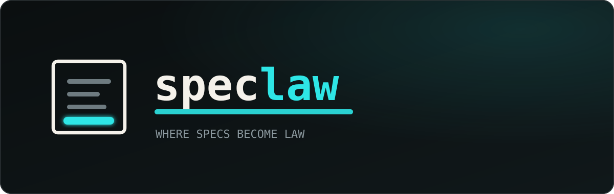

<div align="center">



<br/>

<a href="https://www.npmjs.com/package/speclaw"></a>
&nbsp;<a href="LICENSE"></a>
&nbsp;= 22">

<br/><br/>

<p align="center">
<b>AI agents are brilliant and blind</b> — brilliant at writing code, blind to <i>your</i>
project's rules. <b>speclaw</b> hands them what they're missing: the codebase's
<b>written laws</b> (a constitution built from your real code), a <b>local map</b> to
navigate it without burning tokens, and a <b>disciplined workflow</b> for every change.
<br/>
One command. No cloud, no LLM, no API keys — <b>everything runs on your machine.</b>
</p>


&nbsp;
&nbsp;
&nbsp;

</div>

<br/>

> [!TIP]
> **One command sets everything up.** Run `npx speclaw init`, pick the agents you
> use, and speclaw scaffolds the project, indexes your code, and hands your agent
> a ready-to-paste prompt to finish the setup.

<br/>

## ◆ Quick start

```bash
# in your project root
npx speclaw init
```

`init` will:

1. **Ask which agents you use** (Claude Code, Cursor, Codex, …) — and configure
   only those. Add more later; nothing is forced on you.
2. Write the **foundation** (constitution + standards) and the **spec workflow**.
3. **Index your code** with a live progress bar and a summary of what it found.
4. Register the speclaw **MCP server** in each chosen agent's config.
5. Print a prompt to paste into your agent so it fills the constitution with your
   project's real architecture and conventions.

<sub>Works with <code>npm</code>, <code>pnpm</code> (<code>pnpm dlx speclaw init</code>), and <code>yarn</code>.</sub>

<br/>

## ◆ It looks like this

```text
  ╭────────╮
  │ ────── │   s p e c l a w
  │ ────   │   where specs become law
  │ ─────  │
  │ ▇▇▇▇▇▇ │
  ╰────────╯

  ◇ Setting up acme-api
    ✓ Foundation      — LAWS.md + 8 standards + CLAUDE.md/AGENTS.md
    ✓ Spec workflow   — draft · build · sync · archive · explore
    ✓ dev-agents (backend · frontend · product)
    ✓ Spec workspace  — spec/

  ◇ Configuring agents
    ✓ Claude Code     — symlinks + MCP
    ✓ Cursor          — symlinks + MCP

  ◇ Indexing your code with Compass
    ██████████████████████████ 100%
    ✓ 342 files · 1204 nodes · 3891 edges · 1204 embeddings

  ◇ You're set — one last step
    ╭─ prompt ───────────────────────────────────────────────╮
    │ Complete speclaw's foundation: analyze this repo and    │
    │ fill LAWS.md and docs/standards/* with the real         │
    │ architecture, gates and conventions. Use init_project.  │
    ╰─────────────────────────────────────────────────────────╯
```

<sub>Cyan steps, green checks, a live progress bar — themed with the speclaw palette.</sub>

<br/>

## ◆ The suite — four modules

| Module | What it does |
| :-- | :-- |
| **Foundation** | The project's constitution: `LAWS.md` binding a set of granular standards under `docs/standards/` (base, architecture, backend, frontend, testing, documentation, conventions, spec-workflow), plus strict `CLAUDE.md` / `AGENTS.md` agent contracts — filled from your real codebase. |
| **Compass** | speclaw's own local code graph. Parses your code (tree-sitter) into nodes + edges plus a local vector store, so an agent finds and understands code with a fraction of the tokens a grep/read loop would cost. No LLM, 100% local, lives in `.speclaw/` (gitignored). |
| **Spec** | speclaw's own spec-driven workflow: `draft → build → sync → archive` (and `explore`), backed by `spec_*` engine tools. No external CLI. |
| **Tools** | Opt-in packs of skills and subagents (currently the dev-agents) that agents use for specific tasks. |

<sub>Compass is inspired by <a href="https://github.com/colbymchenry/codegraph">CodeGraph</a> and the Spec module by <a href="https://github.com/Fission-AI/openspec">OpenSpec</a> — both MIT. speclaw reimplements the ideas as its own code and gives full credit; see <a href="ATTRIBUTION.md">ATTRIBUTION.md</a>.</sub>

<br/>

## ◆ Two ways to use it

speclaw meets you where you are. Everything works through the **CLI** — so no one
is blocked by MCP setup — and the same capabilities are exposed as **MCP tools**
for a smoother, integrated experience once configured. An agent without MCP can
still use Compass and the spec engine by calling the CLI from its shell.

<table>
<tr><th align="left">CLI — installer & operator</th><th align="left">MCP — integrated agent surface</th></tr>
<tr valign="top"><td>

```
speclaw init            interactive setup
speclaw agent add <id>  add an agent later
speclaw index / watch   build / refresh graph
speclaw explore <node>  source + callers/callees
speclaw recall "<q>"    find code by meaning
speclaw impact <node>   blast radius
speclaw trace <a> <b>   call path
speclaw spec <cmd>      workflow ops
speclaw doctor          health check
speclaw mcp             start the server
```

</td><td>

`init_project` · `scaffold` · `configure_agent` · `doctor`

`compass_index` · `compass_explore` · `compass_search` · `compass_recall` · `compass_impact` · `compass_trace` · `compass_watch`

`spec_init` · `spec_validate` · `spec_sync` · `spec_archive` · `spec_list`

`list_packs` · `add_pack`

</td></tr>
</table>

<br/>

## ◆ What lands in your project

```
your-repo/
├── LAWS.md                 the constitution — binds the standards
├── CLAUDE.md · AGENTS.md   strict agent operating contracts
├── docs/
│   ├── compass.md          Compass usage cheat sheet
│   └── standards/*.md      the granular laws (one file per concern)
├── ai-specs/               canonical skills, commands, rules, agents
├── spec/                   spec-driven workflow: specs, changes, archive
├── .claude/ .cursor/ …     symlinks into ai-specs (only for chosen agents)
├── .mcp.json               speclaw MCP server registration
└── .speclaw/               the local Compass index (gitignored)
```

<br/>

## ◆ Philosophy — why "laws"?

> [!NOTE]
> A guideline is a suggestion. A **law** is enforced. The most common failure mode
> of AI coding agents isn't lack of capability — it's working without the project's
> tacit knowledge: the rules the team actually lives by. speclaw makes that
> knowledge explicit, executable, and binding, and gives agents a local map
> (Compass) and a disciplined workflow (Spec) to act on it — without burning tokens.

<br/>

## ◆ Requirements

- **Node.js ≥ 22** — uses the built-in `node:sqlite`.
- **No native builds, no services, no API keys, no LLM download.** Tree-sitter
  parsers ship as WASM; the vector store is local.

<br/>

<div align="center">

**[MIT](LICENSE)** &nbsp;·&nbsp; built on ideas from
[OpenSpec](https://github.com/Fission-AI/openspec) &&nbsp;
[CodeGraph](https://github.com/colbymchenry/codegraph) &nbsp;·&nbsp;
see [ATTRIBUTION.md](ATTRIBUTION.md)

<sub><i>speclaw · where specs become law</i></sub>

</div>
